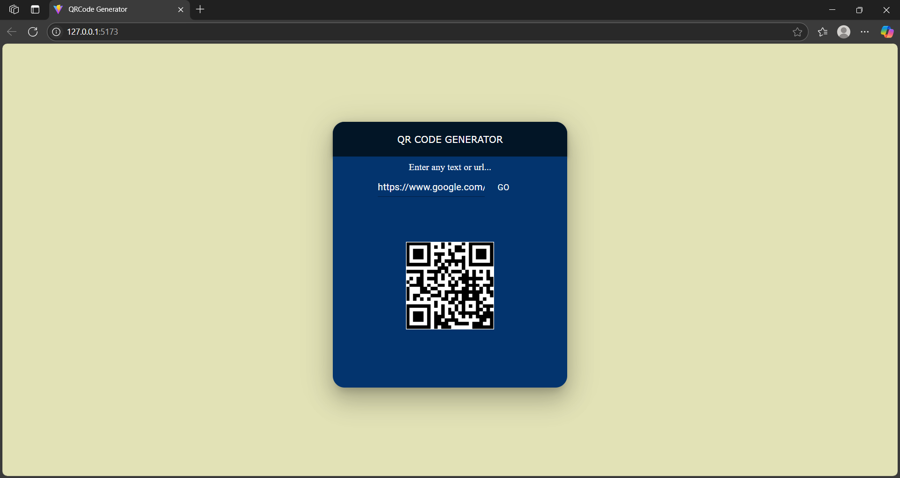

<!DOCTYPE html>
<html lang="en">
<head>
  <meta charset="UTF-8" />
  <meta name="viewport" content="width=device-width, initial-scale=1.0"/>
  <title>QR Code Generator - Project README</title>
  
</head>
<body>
  

    <h1>📱 QR Code Generator</h1>
    
A lightweight and user-friendly QR Code Generator built using <strong>React + Vite</strong>. It supports generating QR codes from any plain text or URL.

    <h2>✨ Features</h2>
    <ul>
      <li>Generate QR codes in real time</li>
      <li>Accepts both plain text and URLs</li>
      <li>Fast and responsive UI with React + Vite</li>
      <li>Uses the free <a href="https://goqr.me/api/" target="_blank">QR Code API</a></li>
    </ul>

    <h2>🛠️ Tech Stack</h2>
    <ul>
      <li>React (via Vite)</li>
      <li>JavaScript (ES6+)</li>
      <li>HTML & CSS</li>
    </ul>

    <h2>🚀 Getting Started</h2>
    <pre><code>git clone https://github.com/your-username/your-repo.git
cd your-repo
npm install
npm run dev</code></pre>

    
Then open <code>http://localhost:5173</code> in your browser.

    

      <h2>📸 Screenshot</h2>
      
      
<em>Example: QR code generated for "https://openai.com"</em>

    

    <h2>📁 Project Structure</h2>
    <pre><code>qr-code-generator/
├── public/
├── src/
│   ├── App.jsx
│   ├── main.jsx
│   └── components/
│       └── QRGenerator.jsx
├── screenshots/
│   └── app-preview.png
├── index.html
├── package.json
└── readme.html
</code></pre>

    <h2>🙋‍♀️ Author</h2>
    
<strong>Subhashree Das</strong>

    

      🔗 <a href="https://www.linkedin.com/in/your-link" target="_blank">LinkedIn</a> • 
      <a href="https://github.com/your-username" target="_blank">GitHub</a>
    

    <footer>
      
&copy; 2025 Subhashree Das • MIT License

    </footer>
  

</body>
</html>
