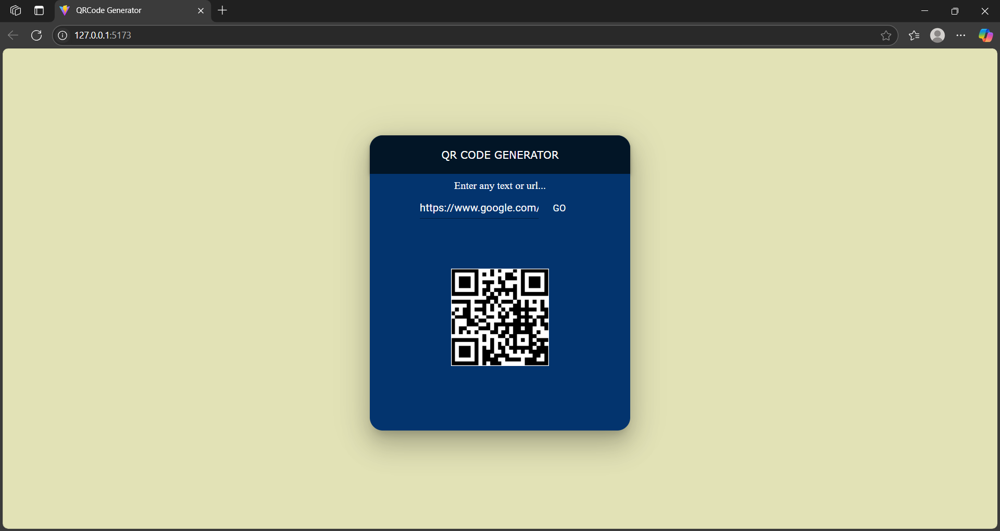

# QR Code Generator 🧾➡️📱

A clean and minimal **QR Code Generator** built using **React + Vite** that allows users to instantly generate QR codes from any **text** or **URL** input.

## 🔧 Features

- ✅ Instant QR code generation
- 🔤 Accepts plain text and URLs
- ⚛️ Built with React (Vite)

## 🛠️ Tech Stack

- React
- Vite
- JavaScript (ES6+)
- [QR Code API](https://goqr.me/api/) (`api.qrserver.com`)
- CSS (Material UI and sweetalert2)

## 🚀 Getting Started

1. **Clone this repository**:
   ```bash
   git clone https://github.com/your-username/your-repo-name.git
Navigate to the project directory:

bash

cd your-repo-name

then Install dependencies:

bash

npm install
npm install @mui/system @emotion/react @emotion/styled
npm install sweetalert2

Run the app locally:

bash

npm run dev

Open http://localhost:5173 in your browser.


🙋‍♀️ Author
Subhashree Das
🔗 [LinkedIn](https://www.linkedin.com/in/subhashree-das-27a622327/) • [GitHub](https://github.com/das-subho06)

📄 License
This project is open-source and available under the MIT License.


---

Here is a screenshot of my project:
